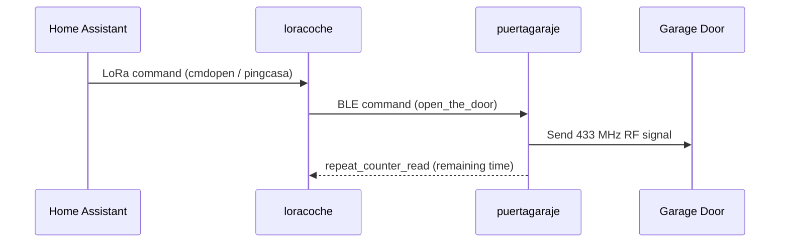
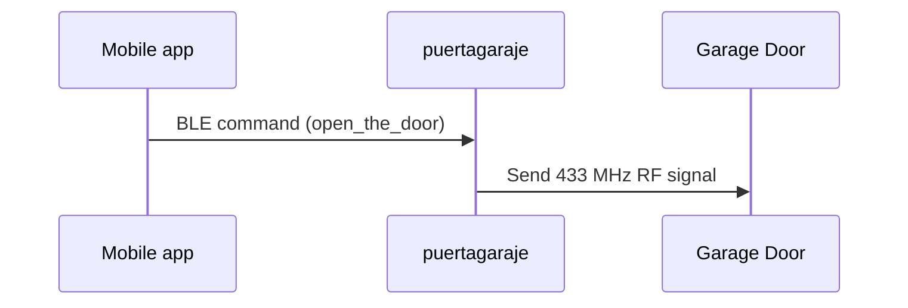

# ESPHome Garage Remote Backend

This system allows you to open your Garage door based on the reception of LoRa commands.
This ESPHome backend has two different modules:
- loracoche
- puertagaraje

There is an [Android Mobile app](https://github.com/luismalddonado/GarageRemoteControl) to control the puertagaraje module directly, too.

## Architecture Diagram





## Hardware Requirements

- **loracoche**: ESP32 with LoRa (SX127x) module and OLED display
- **puertagaraje**: ESP32 with CC1101 transceiver module wired

---

## 🚗 loracoche Features

- Acts as a **Bluetooth client**
- Listens for **LoRa commands**:
  - `pingcasa`
  - `cmdopen`
- Upon receiving valid commands, it sends a BLE command (`open_the_door`) to the **puertagaraje** module
- The module acts as a gateway between your Home Assistant and the **puertagaraje** module
- While previous **LoRa commands** are available in the air, it ensures **puertagaraje** is sending the **433 MHz RF signal**
- An OLED displays the current status of the system

---

## 🚪 puertagaraje Features

- Acts as a **Bluetooth server**
- Listens for BLE commands from the **loracoche** module:
  - `open_the_door`
  - `repeat_counter_read`
- When `open_the_door` is received:
  - Sends a **433 MHz RF signal** for a configured duration (default: 300 seconds)
- `repeat_counter_read`:
  - Returns the remaining time (in seconds) until the RF signal stops

- When using the **Mobile app**, it provides **additional** BLE commands:
  - `learn_code_start`
  - `learn_code_end`
  - `return_learn_code`

### Learning the signal

1. Open the Mobile app and connect to the module
2. Go to the app settings
3. Press the "Start Learning" button
4. Press the button on your RF remote near the module
5. Press the "Stop Learning" button
6. The module will restart in order to ensure data is stored in the flash memory

---

## Configuration

Key parameters you can adjust in the puertagaraje config:

| Parameter | Default | Description |
|---|---|---|
| RF signal duration | 300 seconds | How long the 433 MHz signal is transmitted after `open_the_door` is received |

---

## Getting Started

1. Install [ESPHome](https://esphome.io/guides/getting_started_command_line.html)
2. Flash `loracoche` config to the LoRa-connected ESP32
3. Flash `puertagaraje` config to the CC1101-connected ESP32
4. Add `loracoche` to your Home Assistant ESPHome integration

---

## 📡 Project Base

This project is based on the  
[cc1101-transceiver](https://github.com/phdindota/cc1101-transceiver)

---

## Notes

- Communication flow:
  - Home Assistant → LoRa → loracoche → BLE → puertagaraje → RF → Garage Door
  - Mobile app → BLE → puertagaraje → RF → Garage Door
- Designed for modularity and remote operation
- This is an example snippet to send LoRa commands to **loracoche** from a third ESPHome device connected to your Home Assistant:

```yaml
button:
  - platform: template
    id: open_door
    name: "Open garage door"
    on_press:
      then:
        - sx127x.send_packet:
            data: !lambda |-
              ESP_LOGI("LoRa", "CMDOPEN package sent");
              std::string msg = "cmdopen";
              return std::vector<uint8_t>(msg.begin(), msg.end());

packet_transport:
  platform: sx127x
  update_interval: 60s
  sensors:
    - pingcasa
  providers:
    - name: lorasender1

sensor:
  - platform: template
    name: "PING casa"
    id: pingcasa
    update_interval: 60s
```
